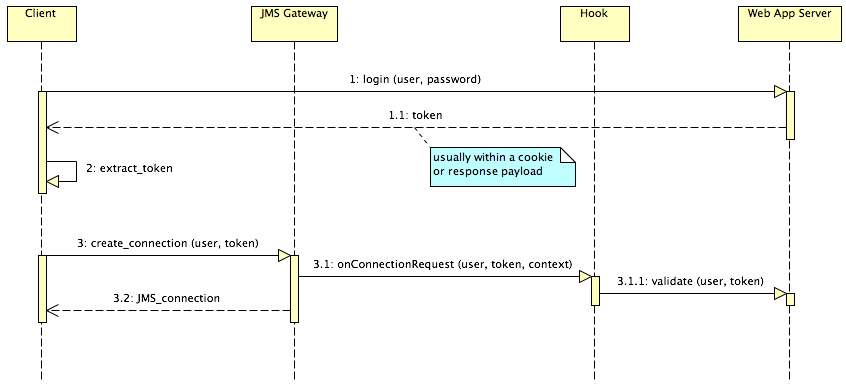

# Lightstreamer JMS Gateway - Authentication and Authorization Demo - Java Hook

The JMS Gateway Authentication and Authorization Demo is a simple example illustrating authentication and authorization mechanisms when an external
Web/Application Server is involved in the process.

This project includes a simple hook implementation that includes user validation and items authorization logics.


##Details

This *Authentication and Authorization Demo* illustrates the typical best practice used for Lightstreamer JMS Gateway Web applications, when a Web/Application server is involved in the process.
The actual authentication is usually handled by the legacy Web/Application server, irrespective of JMS Gateway.
Some sort of token is sent back to the Client through cookies, response payload or any other technique.
When the JMS Javascript Client creates the JMS connection, instead of sending again the full credentials (usually involving a password) to
the JMS Gateway, it sends just the username and the token.
The Hook is passed this information and validates the token against the Web/Application Server that
generated it (or a database or whatever back-end system).

Here is an overview of the whole sequence:



In this demo client the Web/Application server is not actually involved and calls to placeholder methods are performed to validate the tokens.

from `src/jmsgw_auth_demo/hooks/AuthHook.java`:

```java
[...]

AuthorizationResult result= AuthorizationRequest.validateToken(user, password);
if (result != AuthorizationResult.OK)
    throw new HookException("Unauthorized access: token invalid for user '" + user + "'", result.toString());

[...]
```

This demo also implements Authorization handling of consumer, producer and durable subscription creation requests.
Every time a creation request is issued, the hook verifies if the user issuing the request is actually authorized to access to the specified destination.
Again, a real case might query an external service to verify the user authorizations; this demo example simply checks on an hard-coded list

from `src/jmsgw_auth_demo/hooks/AuthHook.java`:

```java
[...]

AuthorizationResult result= AuthorizationRequest.authorizeDestination(user, destinationName);
if (result != AuthorizationResult.OK)
    throw new HookException("Unauthorized access: user '" + user + "' can't receive messages from destination '" + destinationName + "'", result.toString());

[...]
```

Querying an external service at each request is a discouraged approach, though. If the authorizations are actually placed on an external service,
it is suggested to use the approach shown in the `AuthHookWithAuthCache` class where authorizations are queried at connection startup and cached
in the adapter.

More details and comments on how the auth/auth cycle accomplished is available in the source code of the application.


### The JMS Gateway Configuration

* The project includes two different MetadataProvider implementations; replace `AuthHook` with `AuthHookWithAuthCache` to use
the alternative version.
* The project relies on two different JMS Gateway Demo Services to show specific authorizations, they must be configured and
running for the demo to work properly. Please refer to the following projects:
  * [Lightstreamer JMS Gateway - Stock-List Demo - Java (JMS) Service](https://github.com/Lightstreamer/Lightstreamer-JMS-example-StockList-service-java)
  * [Lightstreamer JMS Gateway - Portfolio Demo - Java (JMS) Service](https://github.com/Lightstreamer/Lightstreamer-JMS-example-Portfolio-service-java)

The JMS Gateway Adapter must also be configured appropriately to use the provided hook. Its `adapters.xml` file should look like:

```xml
<?xml version="1.0"?>

<adapters_conf id="JMS">

    <metadata_provider>

        <!-- Optional. Fully qualified class name of a hook with purpose
        	 of authentication and authorization of users. The hook also has
        	 the purpose of decorating names for client IDs and durable
        	 subscriptions. Must implement JmsGatewayHook interface.
        	 See docs for more informations.

        	 The specified class corresponds to the Authentication and
        	 Authorization Demo Hook.
        	 -->
        <param name="hook">jmsgw_auth_demo.hooks.AuthHook</param>

    </metadata_provider>

	<!-- Sample data adapter configured for HornetQ (AKA JBoss Messaging). -->
    <data_provider name="HornetQ">

        [...]

    </data_provider>

</adapters_conf>
```

##Install

If you want to install this Demo in your local Lightstreamer JMS Gateway, follow these steps.

* Download and install the Lightstreamer JMS Gateway.
* Make sure that the JMS Gateway is not running.
* Get the deploy.zip file, from the releases of this project, unzip it, go to the `Deployment_LS` folder and copy the `JMS_Auth_demo.jar` from `JMS/lib` into `adapters/JMS/lib` folder
of your JMS Gateway installation.
* Edit the `adapters/JMS/adapters.xml` file of your JMS Gateway installation by adding the appropriate hook class in the `<param name="hook">` tag of the `<metadata_provider>` section:
  * `<param name="hook">jmsgw_auth_demo.hooks.AuthHook</param>` for the direct version;
  * `<param name="hook">jmsgw_auth_demo.hooks.AuthHookWithAuthCache</param>` for the cached version.
* Launch Lightstreamer JMS Gateway.

## Build

To build your own version of `JMS_Auth_demo.jar`, instead of using the one provided in the `deploy.zip` file from the [Install](https://github.com/Lightstreamer/Lightstreamer-JMS-example-Auth-hook-java#install) section above, follow these steps.

* Download this project.
* Get the `ls-jms-hook-interface.jar` file from the [latest Lightstreamer JMS Gateway distribution](http://www.lightstreamer.com/download), and copy it into the
`lib` directory.
* Assuming javac and jar are available on the path, from the command line run:
      ```sh
      javac -classpath ./lib/ls-jms-hook-interface.jar -d ./classes ./src/jmsgw_auth_demo/hooks/*.java
      ```
* Then create the jar:
      ```sh
      jar cvf JMS_Auth_demo.jar -C classes ./
      ```
* Copy the just compiled `JMS_Auth_demo.jar` in the `adapters/JMS/lib` folder of your Lightstreamer JMS Gateway installation.

## See Also

### Clients Using This Adapter

[Follow this link for a list of clients for this adapter](https://github.com/Lightstreamer?query=Lightstreamer-JMS-example-auth-client)

### Related Projects

* [Lightstreamer - Authentication and Authorization Demo - Java Adapter](https://github.com/Lightstreamer/Lightstreamer-example-AuthMetadata-adapter-java)

## Lightstreamer Compatibility Notes

* Compatible with Lightstreamer SDK for Java In-Process Adapters since 5.1