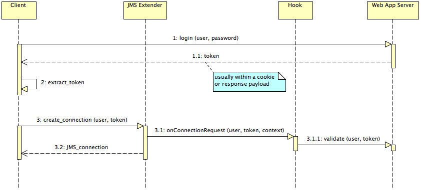

# Lightstreamer JMS Extender - Authentication and Authorization Demo - Java Hook

The JMS Extender Authentication and Authorization Demo is a simple example illustrating *authentication* and *authorization* mechanisms when an
*external Web/Application Server* is involved in the process.

This project includes a simple hook implementation that includes user validation and items authorization logics.


## Details

This *Authentication and Authorization Demo* illustrates the typical best practice used for Lightstreamer JMS Extender Web applications, when a Web/Application server is involved in the process.
The actual authentication is usually handled by the legacy Web/Application server, irrespective of JMS Extender.
Some sort of token is sent back to the Client through cookies, response payload or any other technique.
When the JMS JavaScript Client creates the JMS connection, instead of sending again the full credentials (usually involving a password) to
the JMS Extender, it sends just the username and the token.
The Hook is passed this information and validates the token against the Web/Application Server that
generated it (or a database or whatever back-end system).

Here is an overview of the whole sequence:



In this demo client the Web/Application server is not actually involved and calls to placeholder methods are performed to validate the tokens.

from `src/jmsex_auth_demo/hooks/AuthHook.java`:

```java
[...]

AuthorizationResult result= AuthorizationRequest.validateToken(user, password);
if (result != AuthorizationResult.OK)
    throw new HookException("Unauthorized access: token invalid for user '" + user + "'", result.toString());

[...]
```

This demo also implements Authorization handling of consumer, producer and durable subscription creation requests.
Every time a creation request is issued, the hook verifies if the user issuing the request is actually authorized to access the specified destination.
Again, a real case might query an external service to verify the user authorizations; this example simply checks on an hard-coded list

from `src/jmsex_auth_demo/hooks/AuthHook.java`:

```java
[...]

AuthorizationResult result= AuthorizationRequest.authorizeDestination(user, destinationName);
if (result != AuthorizationResult.OK)
    throw new HookException("Unauthorized access: user '" + user + "' can't receive messages from destination '" + destinationName + "'", result.toString());

[...]
```

Querying an external service at each request is a discouraged approach, though. If the authorizations are actually placed on an external service,
it is suggested to use the approach shown in the `AuthHookWithAuthCache` class where authorizations are queried at connection startup and cached
in the adapter.

More details and comments on how the authentication/authorization cycle is accomplished is available in the source code of the application.


### The JMS Extender Configuration

* The project includes two different MetadataProvider implementations; replace `AuthHook` with `AuthHookWithAuthCache` to use
the alternative version.
* The project relies on two different JMS Extender Demo Services to show specific authorizations, they must be configured and
running for the demo to work properly. Please refer to the following projects:
  * [Lightstreamer JMS Extender - Stock-List Demo - Java (JMS) Service](https://github.com/Lightstreamer/Lightstreamer-JMS-example-StockList-service-java)
  * [Lightstreamer JMS Extender - Portfolio Demo - Java (JMS) Service](https://github.com/Lightstreamer/Lightstreamer-JMS-example-Portfolio-service-java)

The JMS Extender must also be configured appropriately to use the provided hook. Its `jms_connectors_conf.xml` file should look like:

```xml
<?xml version="1.0"?>

<jms_connectors_conf>

    <common>

        <!-- Optional. Fully qualified class name of a hook with purpose
             of authentication and authorization of users. The hook also has
             the purpose of decorating names for client IDs and durable
             subscriptions. Must implement JmsExtenderHook interface.
             See docs for more information.

        	 The specified class corresponds to the Authentication and
        	 Authorization Demo Hook.
        	 -->
        <param name="hook">jmsex_auth_demo.hooks.AuthHook</param>

    </common>

    ...

</jms_connectors_conf>
```

## Install

If you want to install this Demo in your local Lightstreamer JMS Extender, follow these steps.

* Download and install Lightstreamer JMS Extender. Please refer to Lightstreamer web site [download page](https://lightstreamer.com/download/#jms) to find the *Lightstreamer JMS Extender* download packages.
* Make sure that JMS Extender is not running.
* Get the `deploy.zip` file, from the releases of this project, unzip it, go to the `Deployment_LS` folder and copy the `JMS_Auth_demo-2.0.0.jar` from `lib` into the `jms_connectors/lib` folder
of your JMS Extender installation.
* Edit the `jms_connectors/jms_connectors_conf.xml` file of your JMS Extender installation by adding the appropriate hook class in the `<param name="hook">` tag of the `<common>` section:
  * `<param name="hook">jmsex_auth_demo.hooks.AuthHook</param>` for the direct version;
  * `<param name="hook">jmsex_auth_demo.hooks.AuthHookWithAuthCache</param>` for the cached version.
* Launch Lightstreamer JMS Extender.

## Build

To build your own version of `JMS_Auth_demo-2.0.0.jar`, instead of using the one provided in the `deploy.zip` file from the [Install](https://github.com/Lightstreamer/Lightstreamer-JMS-example-Auth-hook-java#install) section above, follow these steps:

* Clone this project

* Assuming that `maven` is installed on your machine, build the hook by executing the package goal:
    ```sh
    $ mvn package
    ```

* Locate the jar file (which should be in the `target` folder) and drop it into the `jms_connectors/lib` folder of your Lightstreamer JMS Extender installation

## See Also

### Clients Using This Adapter

* [Follow this link for a list of clients for this adapter](https://github.com/Lightstreamer?query=Lightstreamer-JMS-example-auth-client)

### Related Projects

* [Lightstreamer - Authentication and Authorization Demo - Java Adapter](https://github.com/Lightstreamer/Lightstreamer-example-AuthMetadata-adapter-java)

## JMS Extender Compatibility Notes

* Compatible with Lightstreamer JMS Extender SDK for Java Hooks since 2.0.0 or newer.
